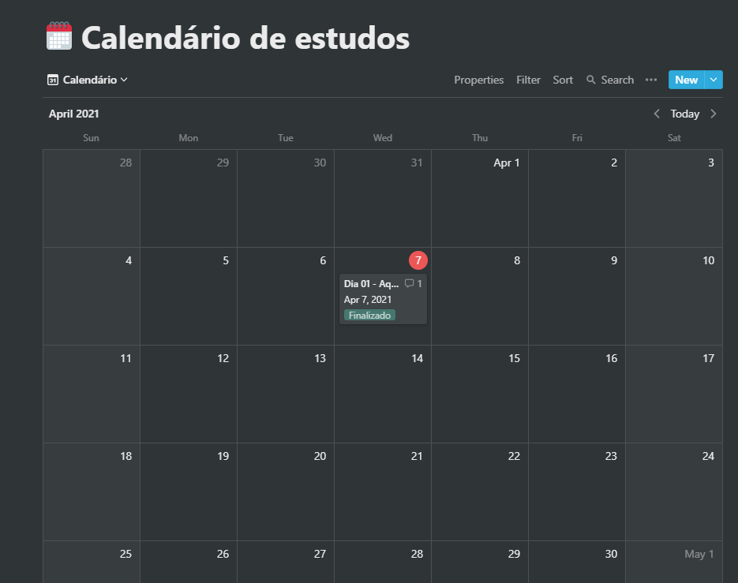
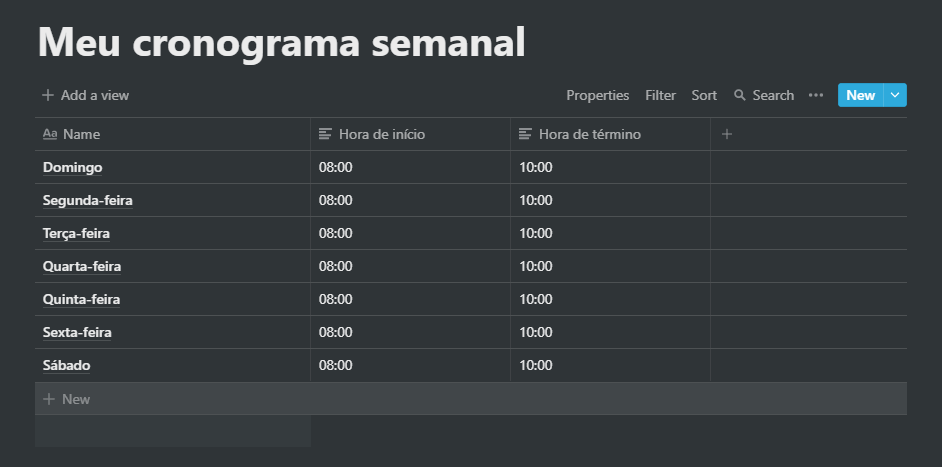

<h3 align="center">
  Desafio 1: Planejando meus estudos
</h3>

“Sua única limitação é você mesmo”!</blockquote>

  

  

  

  

  <a href="#-sobre-o-desafio">Sobre o desafio</a>&nbsp;&nbsp;&nbsp;|&nbsp;&nbsp;&nbsp;
  <a href="#-licença">Licença</a>

# 🚀 Sobre o desafio

Nesse desafio, eu planejei a minha rotina de estudos.

Para isso, tive que criar um cronograma e também um calendário que irão se adaptar ao meu tempo e ritmo.

# 🤖 Resultado

<h1 align="center">
  
</h1>

<h1 align="center">
  
</h1>

# 🧾 Licença

Esse projeto está sob a licença MIT. Veja o arquivo [LICENSE](LICENSE.md) para mais detalhes.

---

Feito com 💗 by [Raphael Barreto](https://www.linkedin.com/in/raphael-barreto) 👋
